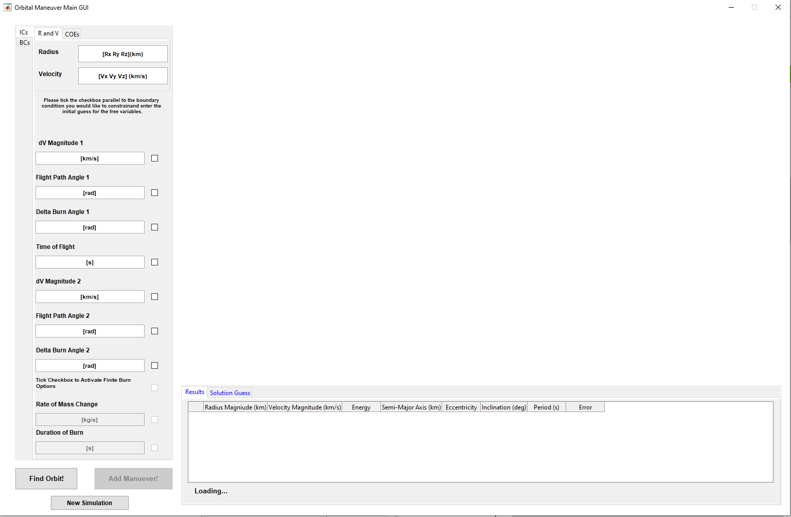
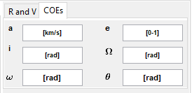
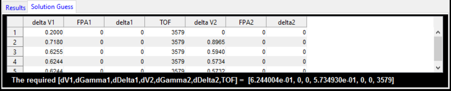

# Orbital Maneuver Simulator

This project showcases a generic maneuver simulator for orbital mechanics with a graphical user interface in MATLAB. 

## Inputs

### Initial Conditions
The user inputs the initial conditions as one of two options which can be navigated using the tabs at the top:

1. Initial position and velocity vectors: R and V at the moment of the impulse.
It is important to use the same units indicated
in the boxes. Also, the Radius and Velocity must be a 3D vector embraced between square
brackets, ‘[]’

2. 6 orbital elements

### Initial Guess

Shown below the Initial Conditions, are the initial guesses for the solution. Tick the checkbox
to set one or more of the guesses as constraints, meaning that you are sure of the answer
and that they must be met. Again, It is important to use the same units indicated in the
boxes!

## Running

To run the system, simply click on the *Find Orbit* button below the inputs.

## Output
From there, just wait and watch the solver iterate and solve. You can view the trajectory attempted as it
is drawn as shown in the Figure below.

Also, you can see the Results obtained in the table at the bottom or navigate using the tabs to see the
guess attempts as shown below.

